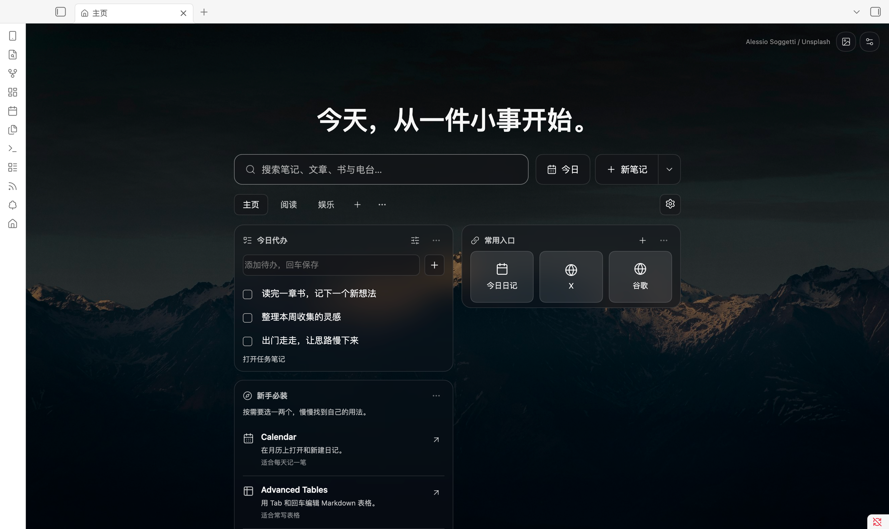
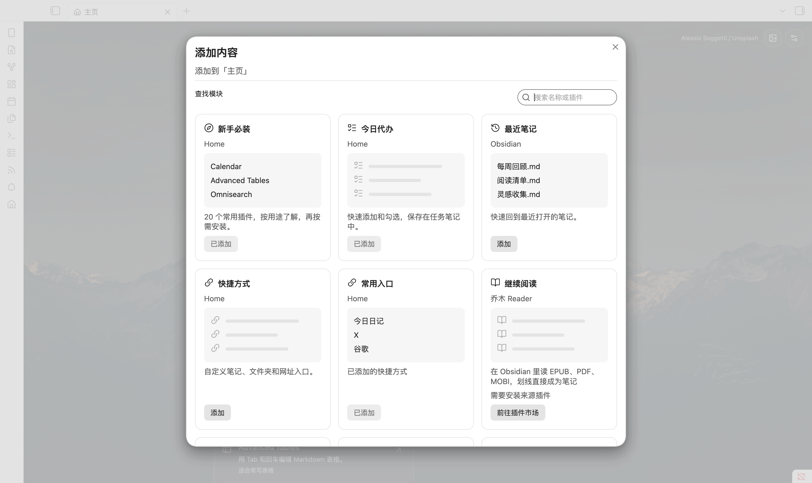
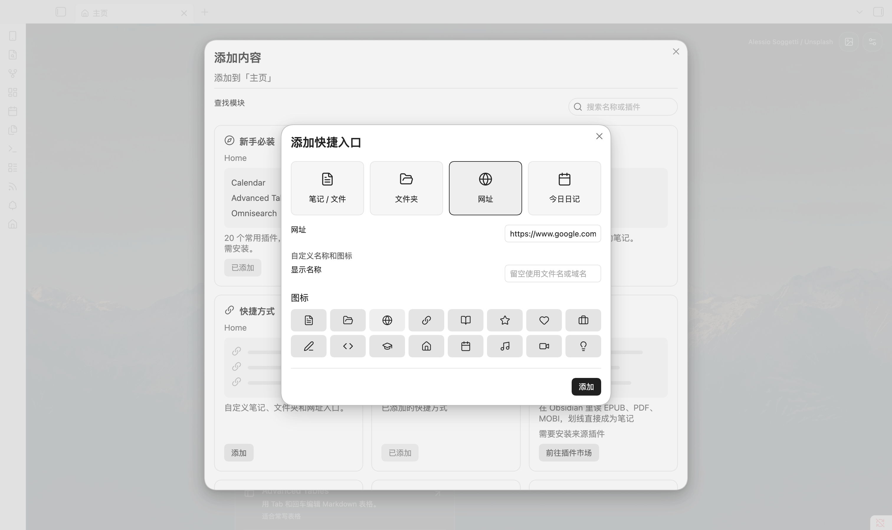

<div align="center">

# 乔木 Home

### 每天打开 Obsidian，都有一个想回来的地方。

A calm start page for your notes, daily tasks, and everything you want to return to.

**中文** · [English](#english)

[](https://github.com/joeseesun/qiaomu-home/releases/latest)
[](https://community.obsidian.md/plugins/qiaomu-home)
[](LICENSE)

**[立即安装 →](https://community.obsidian.md/plugins/qiaomu-home)** · [下载最新版](https://github.com/joeseesun/qiaomu-home/releases/latest) · [反馈与建议](https://github.com/joeseesun/qiaomu-home/issues)



**一个起点。记下一笔，完成一件事，接着读昨天的书。**

</div>

乔木 Home 将启动页和空白新标签页变成你的个人起点：今天要做的事、常用笔记和网址、还没读完的内容，都放在顺手的位置。配上一张喜欢的壁纸，打开就能开始。

无需注册。基础功能独立可用。笔记和待办留在自己的 Obsidian 库里。

## 三步，拥有自己的主页

1. **[打开插件市场页面](https://community.obsidian.md/plugins/qiaomu-home)**，或在 Obsidian 的「设置 → 第三方插件 → 浏览」搜索 **Qiaomu Home**。
2. 点击 **安装 → 启用**，打开一个新标签页。
3. 点击页签右侧的 **齿轮 → 添加内容**，放上你最常用的模块。

新安装预设 **主页、阅读、娱乐**。先用默认布局就好；想调整时，内容、顺序、名称和壁纸都可以改。已有用户升级会保留自己的布局。

<details>
<summary>手动安装 / 更新</summary>

从 [最新 Release](https://github.com/joeseesun/qiaomu-home/releases/latest) 下载同一版本的 `main.js`、`manifest.json`、`styles.css`，放进库的 `.obsidian/plugins/qiaomu-home/`，然后在 Obsidian 设置中启用插件。

更新时仅替换这三个文件，保留 `data.json` 和缓存，再重新加载插件。需要 Obsidian **1.11.4 或更高版本**。

</details>

## 把首页布置成你的习惯

### 想放什么，自己选

待办、最近笔记、快捷入口、继续阅读、未读文章……从模块库添加到当前页签。每个页签拥有独立布局；卡片默认显示 3 条，可以改为 1–6 条。



- **主页**：安排今天，打开常用入口。
- **阅读**：接着读书，浏览未读文章。
- **娱乐**：打开电台，收藏喜欢的网站。
- **你的页签**：写作、研究、项目……按自己的工作方式命名。

齿轮进入布置模式，拖动卡片和页签调整顺序；也可以通过菜单前移、后移。阅读和娱乐页签可以改名或删除，主页始终保留。缺少配套插件时，模块库会给出安装入口。

### 今天的事，写在今天的日记里

在 **今日代办** 输入一件事，回车保存；做完直接勾选。

- 默认写入今日日记，沿用核心日记的目录、日期格式和模板。
- 以前没完成的任务，可以选择结转或全部移入今天；原日记保留指向目标日期的记录。
- 可选自动结转，默认关闭；也可以指定一篇固定任务笔记。
- 任务是普通 Markdown 复选框，离开 Home 也能继续编辑。目前无需 Tasks，也未接入 Tasks。

点击搜索框旁的 **今日**，即可打开今天的日记；不存在时自动创建。

### 常用入口，一下就到

笔记、文件夹、网址和动态今日日记，都能成为快捷入口。默认提供 **今日日记、X、谷歌**，你可以编辑、排序或删除，也能建立多个分组。



先选类型，再填写目标；名称和图标需要时再展开。库内文件改名会更新目标，日记入口始终指向当天。网址使用简洁图标，可手动挑选，不自动抓取网站 Logo。

### 一张壁纸，一句属于你的话

**50 张 Unsplash 精选壁纸**，也能使用库内图片，或配置自己的 Unsplash Key 按关键词找图。支持每天更换、每次打开更换或手动更换，当前壁纸会缓存在本地。

顶部可以显示 **时间与问候**，或换成 **自定义文本**。设置和弹窗采用克制的黑白灰控件，支持浅色与深色外观。

[查看摄影作品与来源 →](docs/wallpaper-credits.md)

### 刚开始用 Obsidian？少走一点弯路

**新手必装** 模块精选 20 个常用社区插件，默认展示 3 个，可展开更多。每个都解释「能做什么、适合谁」，点击进入官方详情，再决定是否安装。

从 Calendar、Advanced Tables、Omnisearch 开始，按自己的需要选一两个即可。[完整清单与选取依据 →](docs/starter-plugins.md)

<sub>以上为桌面端真实界面截图，使用示例任务和笔记；壁纸、自定义文字和布局均可调整。</sub>

## 一个搜索框，把动作变短

| 想做的事 | 怎么做 |
| --- | --- |
| 找一篇笔记 | 输入名称、别名或路径，`Enter` 打开；可转到 Obsidian 全文搜索 |
| 先记下一点想法 | 输入后按 `Shift + Enter`，追加到日记或 Inbox |
| 开始写一篇新笔记 | 点击「新笔记」，或在搜索无结果时新建同名笔记 |
| 创建白板、数据库或文件夹 | 打开「新笔记」旁的菜单 |
| 问 AI | 安装乔木 Agent 后，搜索框 `⌘ / Ctrl + Enter` 提问 |

还可以把常用的 Obsidian 命令放进新建菜单，隐藏不用的动作。

## 阅读、收集、聆听，都能接着来

Home 独立可用。装上相应的乔木插件后，主页还能显示它们的内容和快捷动作。

| 配套插件 | 你在 Home 上得到什么 |
| --- | --- |
| [乔木 Reader](https://github.com/joeseesun/qiaomu-reader) | 书的封面与阅读进度，继续阅读、添加图书、搜索书名 |
| [乔木 RSS](https://github.com/joeseesun/qiaomu-ai-rss) | 未读文章与数量，打开文章、添加订阅、搜索文章 |
| [乔木电台](https://github.com/joeseesun/qiaomu-radio) | 最近电台、播放状态，直接播放或暂停 |
| [乔木 Agent](https://github.com/joeseesun/qiaomu-agent) | 最近对话、新对话，从搜索框直接提问 |

也欢迎其他插件接入：[公开协议与示例](docs/qiaomu-home-protocol.md)。协议文件独立采用 MIT 许可。

## 你的内容，仍然属于你的库

- **无需账号，没有遥测。** 设置保存在本库插件数据中，待办和快速记录写入 Markdown。
- **搜索在本地执行。** 只有主动调用 Agent 时，问题才交给它按你的配置处理。
- **外部图片按需加载。** 壁纸来自 `images.unsplash.com`；自选 Unsplash 搜索使用 `api.unsplash.com`，密钥存在 Obsidian 密钥库。关于页二维码来自 `radio.qiaomu.ai`。
- **插件安装由你决定。** 推荐模块只打开市场或设置入口，不会自动安装、启用其他插件。

### 使用说明与兼容性

桌面端已在真实 Obsidian 测试库验证；移动端尚未完成真机验收。核心日记未启用时，待办使用固定任务笔记。其他启动页插件可能接管同一入口，建议只让一个插件负责启动页。

遇到问题？请在 [Issues](https://github.com/joeseesun/qiaomu-home/issues) 附上版本、系统、复现步骤和去除私人信息的截图。[版本更新记录](https://github.com/joeseesun/qiaomu-home/releases) 可查看每次发布的变化。

## 开发与参与

```bash
npm ci
npm run check # lint、测试、类型检查和构建
```

将生成的 `main.js`、`manifest.json` 和 `styles.css` 复制到测试库的插件目录，即可加载。欢迎报告问题、提出使用场景或提交 PR；涉及交互的变更请附截图和验证步骤。

**许可证：** [GPL-3.0-only](LICENSE)，另见 [商业授权说明](COMMERCIAL-LICENSE.md)。独立协议文件采用 MIT 许可；壁纸遵循 [Unsplash License](https://unsplash.com/license)，在界面内标注摄影师。

## 找到乔木

[乔木](https://qiaomu.ai) · [博客](https://blog.qiaomu.ai) · [工具推荐](https://tuijian.qiaomu.ai) · [X @vista8](https://x.com/vista8) · [GitHub](https://github.com/joeseesun)

微信公众号：**向阳乔木推荐看**。关注与支持二维码也可在插件「设置 → 关于」找到。

---

<a id="english"></a>

## English

### Make Obsidian a place you want to return to

**Qiaomu Home** turns startup and empty new tabs into a personal start page. Bring together daily tasks, favorite notes and websites, recent work, and optional reading or media cards. Choose a wallpaper and start with the next small thing.

**[Install from the Obsidian community directory](https://community.obsidian.md/plugins/qiaomu-home)** · [Latest release](https://github.com/joeseesun/qiaomu-home/releases/latest) · [Report an issue](https://github.com/joeseesun/qiaomu-home/issues)

### Install in three steps

1. In Obsidian, open **Settings → Community plugins → Browse** and search for **Qiaomu Home**, or use the directory link above.
2. Install and enable the plugin, then open a new tab.
3. Select the **gear → Add content** to arrange your page.

Requires **Obsidian 1.11.4 or newer**. For manual installation, download `main.js`, `manifest.json`, and `styles.css` from the same release into your vault's `.obsidian/plugins/qiaomu-home/` directory. Preserve `data.json` and caches when upgrading.

### Built around everyday use

| Feature | What it gives you |
| --- | --- |
| Independent pages | Home, Reading, and Entertainment presets on new installs; rename, reorder, add, or remove optional pages. Existing layouts survive upgrades. |
| Module library | Preview modules, add them to a page, and configure their visibility and item count. Cards default to three items. |
| Daily tasks | Add and complete plain Markdown tasks in today's daily note, or a fixed note. Move unfinished tasks forward manually; automatic carry-forward is optional and off by default. |
| Personal shortcuts | Open a note, folder, website, or today's daily note. Choose names and icons and reorder your entries. |
| Search and capture | Find local notes by name, alias, or path. `Shift+Enter` captures text into an Inbox or daily note. |
| Appearance | Choose from 50 credited Unsplash wallpapers, use a local image, or configure Unsplash search. Show a clock and greeting or your own text. |
| Starter plugins | Discover 20 useful community plugins through short explanations. Show three by default, expand for more, and open official details before installing. |
| Optional integrations | Continue books, RSS articles, radio, and conversations through Qiaomu Reader, RSS, Radio, and Agent. Home also works on its own. |

The screenshots above are actual desktop UI with sample content, a custom heading, and a configured layout. Website shortcuts use selectable icons rather than fetching favicons. The Todo module does not currently integrate with Tasks.

### Privacy and compatibility

No account or telemetry. Settings stay in the vault's plugin data; tasks and captures remain editable Markdown. Search runs locally. Text is handed to Agent only when you explicitly invoke it, and Agent then follows its own configuration.

Wallpaper images load from `images.unsplash.com`. Optional Unsplash search uses `api.unsplash.com` and a key stored in Obsidian SecretStorage. About-page QR images load from `radio.qiaomu.ai` when that page is opened. Recommended plugins are never installed or enabled automatically.

Desktop behavior has been checked in real Obsidian test vaults. Mobile has not been verified on a physical device. Daily tasks fall back to a fixed task note when the core Daily Notes plugin is disabled. If another plugin manages your startup page or new tabs, configure only one to own that entry point.

### Build, extend, and get help

Run `npm ci` followed by `npm run check` for lint, tests, type checking, and a production build. Load the three generated plugin files into a test vault. For bugs, include your OS, Obsidian and plugin versions, reproduction steps, and a screenshot without private data.

Other plugins can integrate through the [Qiaomu Home protocol](docs/qiaomu-home-protocol.md). The plugin is [GPL-3.0-only](LICENSE), with a separate [commercial licensing option](COMMERCIAL-LICENSE.md); standalone protocol files are MIT licensed. Photos follow the Unsplash License and retain photographer attribution.

**[Give your next new tab a home →](https://community.obsidian.md/plugins/qiaomu-home)**
